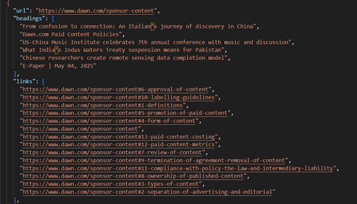

# Web Crawler Project

## 📌 Overview

The **Web Crawler Project** is a lightweight Python-based crawler that automates the process of fetching and organizing data from web pages.  
It fetches HTML pages from a **seed URL**, parses them using **BeautifulSoup**, and extracts structured information such as:

- Hyperlinks
- Headings
- Images
- Metadata

It supports **recursive crawling** up to a configurable depth while filtering out duplicates and external links.  
The output is stored in a **structured JSON format**, making it useful for academic research, journalism, data analytics, and digital archiving.

---

## 🚀 Features

- **Link Extraction** → Extracts and resolves all hyperlinks (`<a href=...>`).
- **Heading Extraction** → Captures headings (`<h2>`).
- **Image Extraction** → Collects image sources (``).
- **Recursive Crawling** → Supports configurable depth to simulate multi-level site traversal.
- **Content Filtering** → Ignores duplicates and external domains.
- **JSON Output** → Stores structured results including page URL, headings, links, and images.

---

## 🛠️ Tech Stack

- **Language:** Python 3.9+
- **Libraries:**
  - `requests` → For HTTP requests
  - `bs4 (BeautifulSoup)` → For HTML parsing
  - `json` → For structured data storage
- **Environment:** Jupyter Notebook (or any Python IDE)

---

## ⚙️ Installation & Setup

1. Clone the repository:

   ```bash
   git clone https://github.com/yourusername/web-crawler.git
   cd web-crawler
   ```

2. Create a virtual environment (optional but recommended):

   ```bash
   python -m venv venv
   source venv/bin/activate   # On Linux/Mac
   venv\Scripts\activate      # On Windows
   ```

3. Install dependencies:
   ```bash
   pip install requests beautifulsoup4
   ```

---

## ▶️ Usage

1. Run the crawler with a seed URL:

   ```bash
   python crawler.py "https://example.com" --depth 2
   ```

2. Output will be stored in `output.json` in the following format:
   ```json
   {
     "url": "https://example.com",
     "headings": ["Example Heading"],
     "links": ["https://example.com/about"],
     "images": ["https://example.com/image.png"]
   }
   ```

---

## 📊 System Architecture


---

## 🎥 Project Demo

Here are some sample screenshots of the project in action:

- **Extracting all hyperlinks **  
  

- **Crawls internal links up to a configurable depth to simulate multi-level site traversal.**  
  

**Storing the Results in a structured json form**

The data is saved in the json format, in which a specific page’s url is first saved, then the heading present in that link are saved, then the hyperlinks in that url are saved, and then the images in that are saved.



---

## 👨‍💻 Project Contributors

- **Sajjad Ali (22K-8729)**
- **Hasan Abdul Rehman (22K-8727)**

Department of Computer Science  
National University of Computer & Emerging Sciences

---

## 📚 References

- [BeautifulSoup Documentation](https://www.crummy.com/software/BeautifulSoup/bs4/doc/)
- [Python Requests Documentation](https://docs.python-requests.org/en/latest/)
- Kumar, V. _Web Crawlers: Theory and Practice_, Springer, 2018

---
